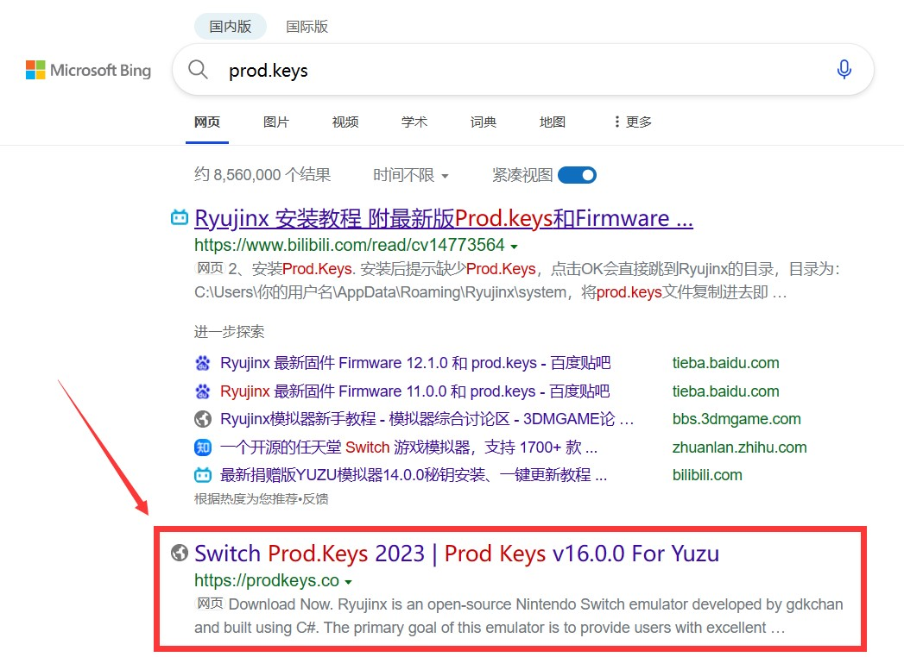
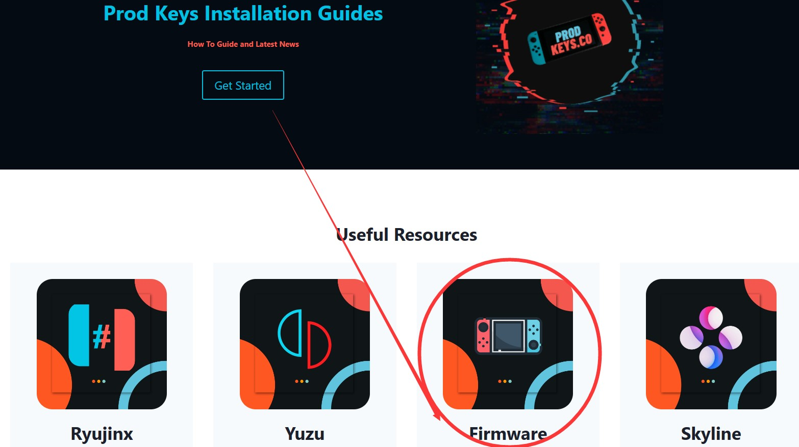

public:: true
date::  [[May 12th, 2023]] 
tags:: Game

- ## 开始
- 下载[[Ryujinx]]，在github里找到主页和下载地址。
- ### 第一次配置推荐：便携模式
- 根据[文档](https://github.com/Ryujinx/Ryujinx/wiki/Ryujinx-Setup-%26-Configuration-Guide#portable-mode)介绍推荐是在主程序目录创建子文件夹`portable`，这样应用配置都会存放在里面。
- ### keys配置
- 根据[文档](https://github.com/Ryujinx/Ryujinx/wiki/Ryujinx-Setup-%26-Configuration-Guide#initial-setup---placement-of-prodkeys)介绍，你需要获取自己NS主机的keys并放入ryujinx目录中的`system`，这里可能盗版不知道如何获取，网上搜索一下也有别人的分享，这里推荐[Switch Prod.Keys 2023 | Prod Keys v16.0.0 For Yuzu & Ryujinx](https://prodkeys.co/)
- 
- ### 固件安装
- 根据[文档](https://github.com/Ryujinx/Ryujinx/wiki/Ryujinx-Setup-%26-Configuration-Guide#initial-setup-continued---installation-of-firmware)介绍，通过第三方工具从NS主机中获取固件，但同样的，也可以在[prodkeys.co](https://prodkeys.co/)中获取：
- 
- ### 部署游戏
- 直接参考[文档](https://github.com/Ryujinx/Ryujinx/wiki/Ryujinx-Setup-%26-Configuration-Guide#adding-your-games-to-ryujinx)吧，不多说了，主要就是ryujinx通过读取文件夹，文件夹中可以放入所有游戏文件（.XCI），载入游戏列表，并且包括安装升级文件（.NSP）。
- ### 配置控制器
- 一般就是用的手柄，XBOX布局的手柄常见些，可以读取控制器预设，校准一下按键就可以用了。
- ### 开始游戏吧
- 鼠标双击游戏就直接在窗口里启动了。
- ## 关于格式
- xci/nsp是游戏的可加载文件，xcz/nsz就是前者的打包压缩文件，后者需要解压成前者才能使用。工具推荐[SAK](https://github.com/dezem/SAK)非常方便，这种工具也很多，不过要注意的是需要keys文件才能使用功能。