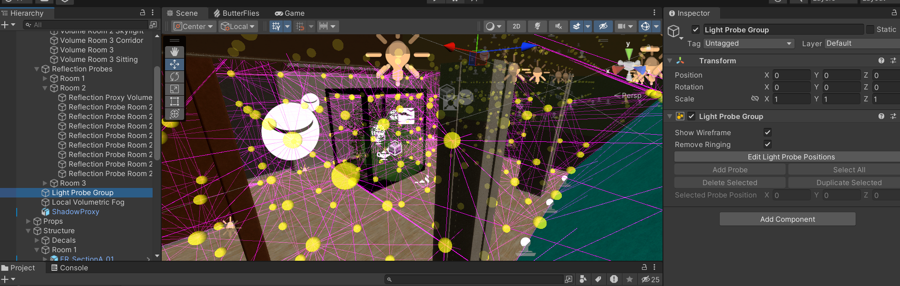
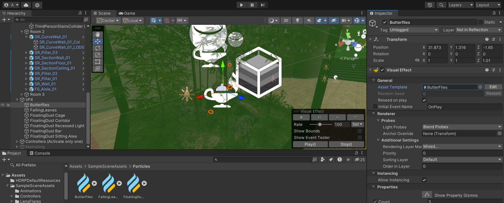

public:: true
tags:: Game

- [[Aug 23rd, 2023]] 研究一个项目，最好就是直接看示例，[[Unity]]也有示例模板，其中大家可能比较熟悉的就是[[HDRP]]3D场景模板。Unity官方有个叫[[PlasticSCM]]的项目版本控制系统，像[[Git]]那样，不过我也尝试了一下用Git管理项目，在 [[.gitignore]] 里也有[参考模板](https://github.com/github/gitignore/blob/main/Unity.gitignore) ，不过感觉对项目管理不是很直观，因为大部分参数只在编辑器里显得有意义。
	-  _场景中的 Light Probe 组_
	-  _场景 VFX 中的“蝴蝶”特效_