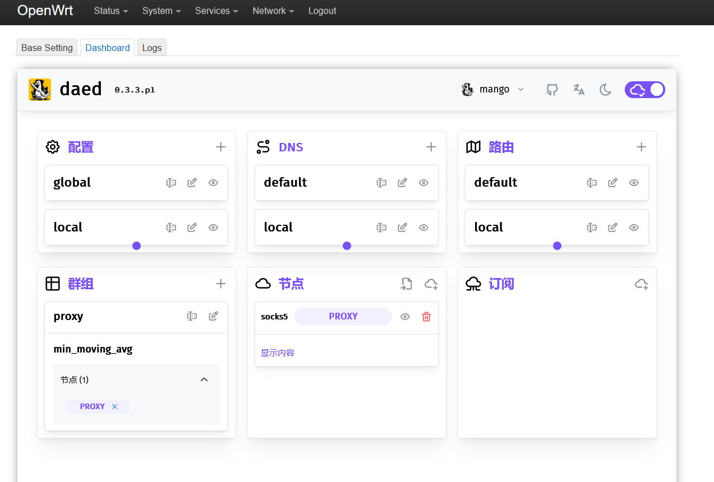

public:: true
date:: [[Aug 28th, 2023]]

- [[openwrt]] 插件
	- https://github.com/QiuSimons/luci-app-daed
	- https://github.com/sbwml/luci-app-dae 实际编译可能不大成功
- 
- [[dae]] 有个特点就是可以指定网口代理，并且它的功能都是基于内核，[[openwrt]] 的话在编译中开启`BPF`，通常的发行版中默认是不开启的。和其他传统代理工具相比，同样的配置 [[dae]] 能做到更轻量和无痛，同时对CPU压力也小很多。
- 我个人的使用习惯是直接运行一个只提供`socks5`代理的服务， [[dae]] 虽然自身也可以完成规则路由，并据称效率更高，但我选择除了局域网外全部交给`socks5`服务处理路由，在网络接口上只处理`lan`口。