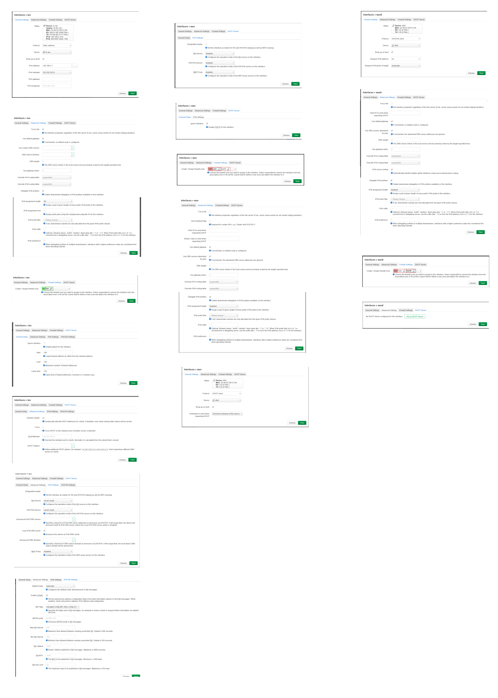
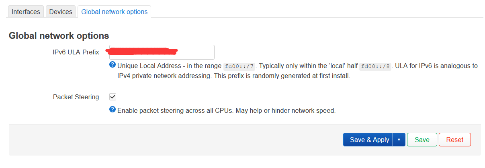
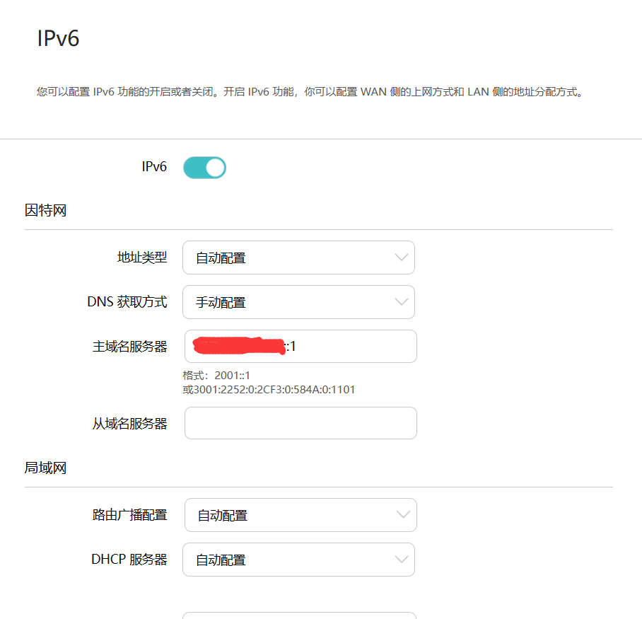
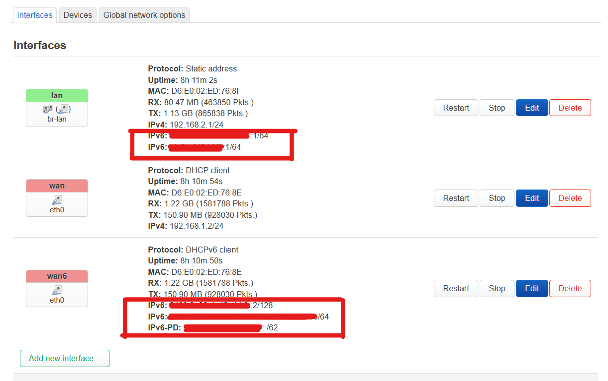

public:: true
date:: [[Aug 28th, 2023]] 
tags:: DevOps

- # 固件扩容
- 参考： https://www.izilzty.com/?post=5
- 此适用于`squashfs`分区类型的固件，并且是在机器首次启动前就应该做好固件扩容的处理
- ```shell
  dd if=/dev/zero bs=1M count=1024 >> openwrt.img
  # 其中count=1024为要增加的大小，单位为MB
  
  fdisk openwrt.img
  # 删除原来的分区，删除的目的是为了从原来分区位置建立新大小空间的分区
  
  ...
  
  Partition #2 contains a squashfs signature.
  
  Do you want to remove the signature? [Y]es/[N]o: n
  # 确定新分区大小后会检测到原分区位置存在的 squashfs 签名，我们保留它
  
  ...
  ```
- # 主题 argon
	- https://github.com/jerrykuku/luci-theme-argon
	- https://github.com/jerrykuku/luci-app-argon-config/
		- 有个小毛病，直接上传文件会只有个2kb的无效文件，通过sftp传的文件会当场消失，解决方法就是直接上传后，再sftp同文件传一遍直接覆盖即可。
- # ipv6接口的配置
- 默认编译中包含ipv6的接口，但某些固件默认不会配置的话就需要手动配置了。
- 手动配置一个`wanv6`接口
	- {:height 1057, :width 748} _配置参考_
- ipv6 ULA 生成用于内网前缀 https://www.unique-local-ipv6.com/
	- {:height 268, :width 748}
- 如果`lan`口下还有个路由器要注意`ipv6`配置
	-  这里 DNS 配置和前面配置的 ULA 前缀对应
-  配置成功大概是这个样子