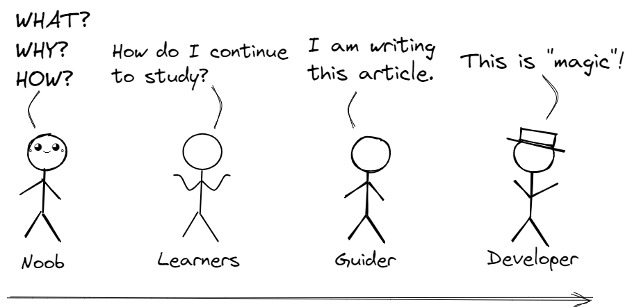

public:: true

- 我曾经想过写一些很酷的东西，作为一种能指导新手的文章，由于各种原因人们很难去介绍我们究竟在“干什么”。在这方面不同的人会有不同的介绍和描述方式，大多数情况下还是非常的单刀直入、直击主题，但我厌倦了这种方式，我相信那些处理过很多问题的人就知道，现在网上的文章时效性很难保证，很多细节无法被覆盖，问题依然在那里可能过了很久都没人解决。那到底该怎么办呢？然后我做出了这样一种设想：更为通用的描述。实际上这个说法并不准确，并且这种方式并不是独有的，在很久以前古人多少都做过这样的事情。
- 技术的会不断的更新变化，但是一些方法论却能帮助你应用在各个场合。但其实再仔细想想，信息的传递和知识并不是单方向的，需要两方共同努力，我想尽可能达到这样的目的。
- 我想说确实有这么些现象。
- 有这么部分读者，他们在阅读到无法理解的部分后会开始放弃继续阅读，或者说“卡在这”以导致无法继续，这是很正常的事情，所有人都会遇到，最好的建议就是先把这个“疑问”放在一边或者标记一下，把它想象成一个“盒子”，然后带着这个“盒子”继续探索下一个部分，这样在不断的深入中我们会把疑问解开。
- 耐心是个很重要的东西。
- 有人说：“大佬不用看，小白看迷糊” ，实际上这是一种消极的观点，在任何一个知识领域如果保持这样的观点，无疑是一种自我封闭的行为，为什么这么说？因为并不是所有人从一开始就什么都懂，有些人刚踏入这个领域，有些人带着热情但是没有基础，有些人知道些什么但是无法继续深入，而这时总是要有人来引导他们渡过这段时期，而这种引导并不需要你多么负责或详尽，作为“过来人”更多的是需要一些耐心和宽容，去做一些该做的事。
- 
- 更多时候人们在网上写的东西如代码或计算机，这些东西是如此的具体而又抽象，愿意的话你甚至可以称其为“魔法”，专业，在学校中学到的可能太过有限，这让其失去了魅力也带来了一些误会。
- 对于那些 _伸手党_ 我也有必要强调我的态度，很多时候“教程”或文章是为了 _减少不必要的人力消耗_ 下，帮助小白获取必要的基础知识。对此，我也鼓励人们能读一读 [《提问的智慧》](https://github.com/ryanhanwu/How-To-Ask-Questions-The-Smart-Way) ，没有人能无偿的帮别人的问题买单。
- > 关于要不要写具体而详细的操作教程，我会说网上有太多这样的教程，好的也有烂的也有，但是你叫我写我是坚决不的：因为即使你写的再详细，这些蠢货依然会不明白这玩意是怎么回事，甚至^^不知道自己在干什么^^，因为只要看到这玩意起作用后他就马上把那些问题都^^抛之脑后^^了！之后随着时间的拷打，用户就会遇到各种问题，而他们当然也不会再回来看你那写的事无巨细的手册，然后就会到网上到处抓到人就问出各种你早在教程里写过解答的**蠢！问！题！**，然而这些蠢问题根本没法叫人来回答！聪明点的或许会自己在网络中可怜的检索解决方案，又或是遵守[提问的智慧](https://github.com/ryanhanwu/How-To-Ask-Questions-The-Smart-Way) 。而这是用户的问题吗？当然不是，就算是写教程的人也没有责任和义务回答这些问题。所以在这里我希望以构建 _公式_ 的形式教用户怎么做，以及 _公式_ 的推理过程。如果你非常幸运的一口气学习完了这些内容，这些 _公式_ 你可以在以后，套在任何相似的场景或工具上，到那时你就能够熟悉的处理遇到的问题。
- > 你觉得再安全的防护，在我看来都一样：^^因为没人能够担保^^。社会上任何系统和秩序都需要人维护，假如没有人能够确保这一切，那你该如何相信？即使它技术再高效智能和严密，那在我看来都是^^幻觉^^，现实里因此而受到损失的例子已经太多了。