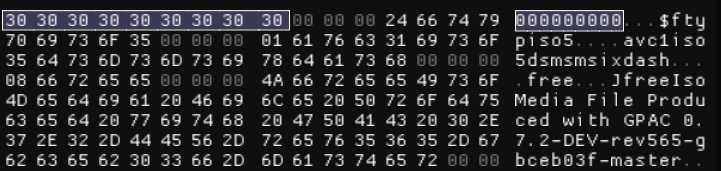
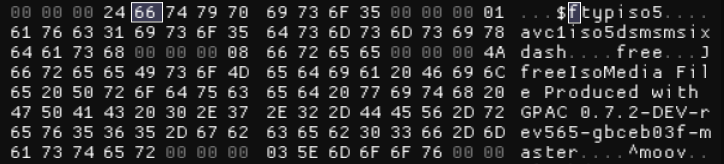

public:: true
date::  [[Jun 1st, 2023]]

- 半夜研究B站客户端（PC端）缓存视频，无法解析文件内容。中间想了很多可能，可能是加密或是新格式，但这些对于视频来说开销是很大的，并不高效和经济。
- 后面直接看hex，通过和正常的视频文件信息头对比发现，只是多填充了几个无意义字节，让播放器无法正确判断文件格式，只能说方法真是简单呢😀。
	- 
	- _填充过的无效信息头_
	- 
	- _正常的有效信息头_
- LATER 看一些 bilibili 缓存转换的项目是怎么处理的