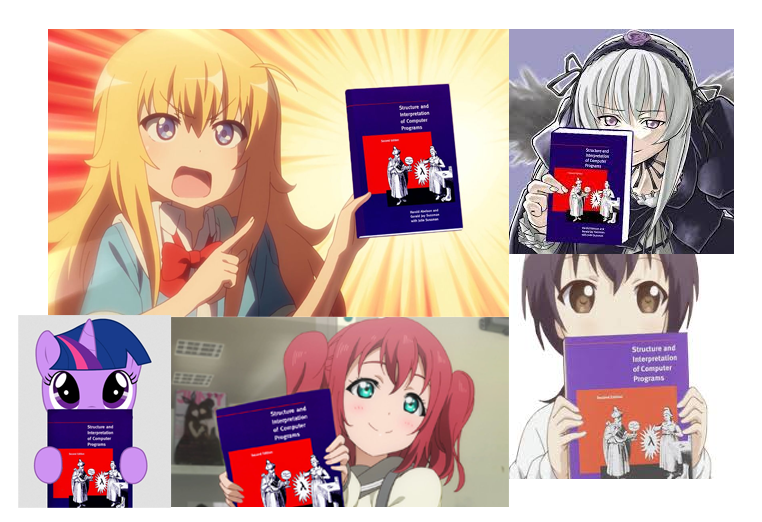

public:: true

- ## 魔法师的咒语
- 我想，如果魔法真实存在，那它的施展绝不是挥挥手那么简单，至少得像《哈利·波特》那样拿个手杖念个咒语，不过唯一不同的是，这不是巫师专有，而是麻瓜也能使用的魔法，就像如今的手机那样人人都能使用，仅仅一块石头大的东西，就能让人们隔着千里互相联系，人们的大多数生活也都可以通过手机完成，而这不何种是魔法，人类在这个世界用自己的方法实现了“魔法”。
- 
- 而作为计算机中最为经典的教科书 _SICP_ （《Structure and Interpretation of Computer Programs》计算机程序的构造和解释）。它的封面中有个巫师拿着阴阳球和量角器，这种魔幻的色彩也告诉着我们一个思想——即使在一个没有“计算机”和“科学”的世界里，我们也能像魔法师那样去思考并追求我们想要的东西。游戏《看门狗》开场动画中，黑客称自己“We are the modem day magicians.”（我们是现代魔法师）。
- 对于程序来说，编程的代码就是构成它们的“咒语”，咒语的千变万化都是为了能够实现某种魔法。而对于大多数人来说，我们并不需要为了使用魔法从头编写咒语，但是也要花一些时间去了解前置知识，这样才能更好的理解和使用它们。~~除非你想永远当个麻瓜~~
- ## 黑箱概念
- 黑箱概念（**black-box abstraction**，又名“黑盒抽象”）， _SICP_ 中讲述的一种包装，通过简化结构的过程，去组织更强大和丰富的系统。
- 在科学计算的体现上：过去我们要从一个复杂的过程中得出结果，需要进行冗长的计算，这个过程可能已经长到人类无法用大脑去记住它了。而我们通过驱动一种“魔法”，把这些过程包装，这样我们只需要丢进一个值（输入），就能直接得出一个结果（输出），通过这样的方式我们可以将越来越多的包装组合在一起达到惊人的效果。这样你可能会问：我们人类在纸和笔上也可以完成这些工作呀？但这就像“一百个人干一件事”和“一个人干一件事”的区别；“鸟儿飞行”和“火箭飞行”的区别那样。
- 告诉你这些的目的不是为了让你去学习上面这些复杂的原理，这也并不是黑箱原本的目的，而是在运用这些黑箱之前，你至少要搞清楚要获取哪些信息（输入）才能得到你想要的结果（输出），这是我们需要学习的东西。
-  *Harold Abelson教授SICP公开课的节选*