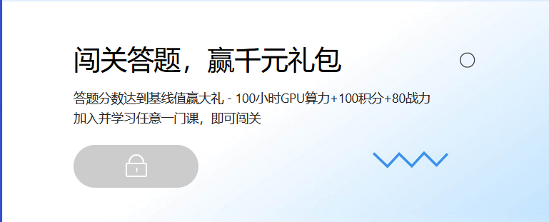
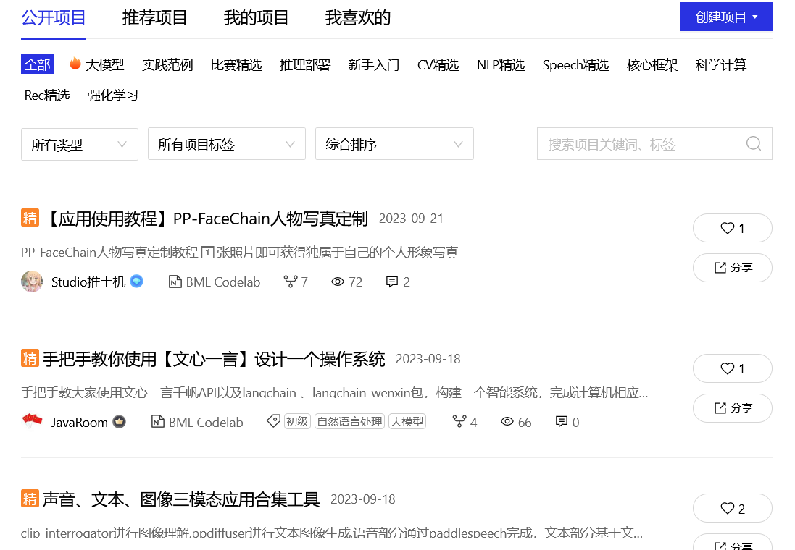

public:: true
date:: [[Sep 22nd, 2023]]

- ## 注册
- 百度账号注册登录即可。
- ## 填写认证信息
- 如果要使用平台的算力资源需要填写补充个人信息：真实姓名和电话号码，学校或者工作单位。该信息以后会用于平台联系你。我个人真实姓名用了拼音代替，填完后提交就可以立即完成无需等待。
- ## 算力卡
- 算力设备是按时间算的，用算力卡点数结算。免费的方式是每天运行一个项目会领取为期24H的4H算力时间。虽然每天只有4个小时，但是从免费以及能用专业设备来说还是挺客观的。
- ## 新手任务
- 地址 https://aistudio.baidu.com/newbie
- 这是官方的新手任务，完成可以领取为期 _3个月_ 的 _100小时_ GPU算力卡。
- 
- ## AI学习地图
- 地址 https://aistudio.baidu.com/learnmap
- 你要是闲的话还可以完成该任务领算力卡。
- {:height 305, :width 734}
- ## Paddle框架
- 地址介绍 https://www.paddlepaddle.org.cn/
- 在飞浆AI Studio平台只能使用Paddle框架，它包含了一整套深度学习的工具，所以包括依赖包和环境部署都依赖它。
- ## 运行项目
- 这才是重头戏，也就是可以用飞浆平台的算力进行开发。实际上你也不用全部手动完成，里面有来自别的用户现成的模板直接使用（fork）。
- 项目是通过 notebook 完成的，基于 [[python]] 的 Jupyter 工具，如果你用过类似的产品或开发栈会很熟悉这个东西。
- 除了运行平台，它还自带模型数据库，可以免去在项目中重复下载模型的麻烦，可以直接在平台中调用。
- 
- ## 运行环境
- 目前支持可以免费使用的算力设备：
	- 纯CPU 2 Cores
	- V100 ^^16G 2 Cores^^ / ^^32G 4 Cores^^
	- A100 40G
	- V100 四卡